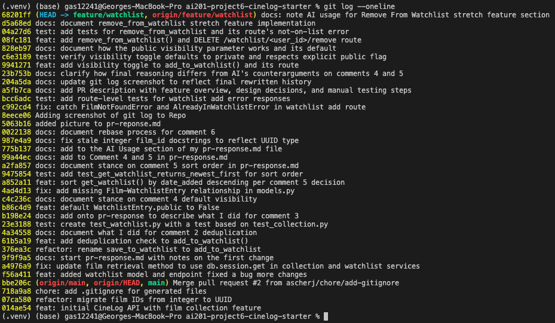

# PR Response Doc — CineLog Watchlist Feature

## AI Usage

<!-- Fill in at the end — how you used AI tools during this project -->

One of the first things we are told to do is to ask Claude for help in navigating the codebase. This included a summary of models.py, a function explanation of add_to_collection(), and asking about the test structure found in the test_collection.py tests.

I used Claude to write the test_watchlist.py file as well. It was pretty similar to test_collection, so with that context, it returned a working test.

One thing that I've seen people do but never done myself (mostly because I've seen it done with a keyboard shortcut), is change the name of one symbol, and have it affect all references of it. I asked Claude to tell me how you can do that in VS Code, which helped with the first comment.

Talking about comments, for the first 3 comments, I did ask Claude to check if I was missing anything after implementing it myself. I used it as a way of making sure I wasn't missing anything.

For the rebase section of the project, I asked claude to help with the rebase. I took note of what it did (prompting it to give me the steps it took to finish the rebase), and asked Cladue to write the rebase section of this file.

Lastly, I asked Claude to write steps for manually testing

## Comment 1 — Rename

Rename save_to_watchlist() to add_to_watchlist() in services/watchlist_service.py and update all call sites (there is one in routes/watchlist/watchlist.py). Use your editor's find-all-references or a project-wide search to confirm you haven't missed any.

**What I did:** I used VS Code's "Rename Symbol" feature to change `save_to_watchlist()` to `add_to_watchlist()`.
**How I verified:** After changing the name, I then used "Find All References" to make sure that the number of calls to the new method name was the same as the old method. I also double checked with Claude just to be safe, since it's my first time using the feature.

## Comment 2 — Deduplication

Add deduplication logic to add_to_watchlist() in services/watchlist_service.py. Look at how add_to_collection() in services/collection_service.py handles this — follow the same pattern.

**What I did:** Added a conditional in the add_to_watchlist() method found in the watchlist_service.py file that checks if the film is one the User has already added to their watchlist.
**How I verified:** I followed the same pattern as add_to_collection() does, including adding a custom Exception class to the file. I did double check using Claude to see if the code works the same.

## Comment 3 — Missing test

Create a new file tests/test_watchlist.py. Read tests/test_collection.py and find test_add_to_collection_nonexistent_film_raises — write the equivalent test for add_to_watchlist() following the same fixture and assertion structure.

**What I did:** Created a test file for watchlist, and wrote a test named `test_add_to_watchlist_nonexistent_film_raises` which was similar to `test_add_to_collection_nonexistent_film_raises` in the test_collection.py file.
**How I verified:** I ran the test suite, first by only running the test that I just added. When that passed, I ran the whole test suite to make sure nothing broke.

## Comment 4 — Default visibility

NOTE: At the top of the HW assignment, it makes it sound like we won't have to write code for the decision comments. Under Milestone 3, it says: "Comments 4 and 5 aren't code problems — they're design conversations. Both require written arguments, not just code." This makes it sound like I have to do both, so I made a decision AND changed code to make public = False by default.

I notice watchlists default to public=True. We don't have a documented decision on default visibility for user lists. Before I can approve this, I need you to add a note to your PR description explaining your reasoning. I want to make sure we're being intentional here, not just inheriting a default.

**My position:** I think watchlists should default to NOT being public (public = False).
**Reasoning:** I think it's a better bet to make the default with user privacy in mind. An example that came to mind when thinking of this is when Steam changed everything so that users had to opt into sharing things on their profile (I believe this was in response to Facebook leaking data). I think this is nice because if you're curious about the watchlists of friends, you'll end up asking them about it and bringing up the choice of whether or not they want to make it public (which will also remind the user to make theirs public as well if they so choose).In this way, people who are social will end up seeing their friends film watchlist, while those who could care less, don't have their information out in the open.

One little caveat I would add is to make it painstakingly clear to the user that the toggle for private vs public watchlists exist. Relying on word of mouth solely would ba a grave mistake.

**Tradeoff acknowledged:** Some people might not even think to make their watchlist public, and in that case, it could end up not bringing the community together in the way that we would want. That being said, I do believe User Privacy should be the biggest priority between the two.

## Comment 5 — Sort order

I'd prefer watchlists to default to "date added" order rather than alphabetical. Most users want to see what they added recently. I'm open to discussion if you see it differently — but let's make a decision and document it.

**My position:** Unless I am reading this incorrectly, I agree that watchlists should be oredered by "date added" with the most recent additions being the first ones to show up.
**Reasoning:** When I think about movies that I want to watch, if I have been reminded about it and add it to my watchlist, I usually have the itch to watch them sooner rather than later. Because of this, I think it makes the most sense to return the movies that were most recently added, first. I also think that if you return movies in order alphabetically, if you have many movies in your recommended, it might cause the watchlist to have the same or similar returnings in order over and over again if you don't add any movies that break the top X movies alphabetically.

I also want to address that you could argue this is more of a personal take rather than one based on how the code works and what the project might stand for. The reviewers point for sort order was based on pesonal opinion, so I think it would be fair to use my personal opinion as well.

For reasons against this sort of sort, it would be that not everyone enjoys seeing movies added most recently. I think the best case scenario would be to have something to toggle between multiple sorting styles, but I'm not sure how reasonable that is to do.

The other reason you wouldn't want the most recent movies first, is that people would forget about the movies you've added a while ago, and they would continue to sink lower down the list.

**Engagement with reviewer's point:** I agree wholeheartedly with the reviewer. If I get reminded of a movie, and I add it to my watchlist, I would like to see it to get it out of the watchlist. Waiting too long will cause me to lose interest in the film.

## Comment 6 — Rebase

**What conflicted:** I ran `git fetch origin` followed by `git rebase origin/main` to bring in main's changes, which included a refactor that migrated `Film.id` from an integer to a UUID string. Two conflicts came up:

1. `.gitignore` — an add/add conflict. Both my branch and main independently added a `.gitignore` file, and mine had an extra `.pytest_cache/` entry that main's didn't.
2. `models.py` — a real content conflict. My `WatchlistEntry` model (added on my branch) still defined `film_id` as `db.Integer`, but main's refactor had already changed `Film.id` and `CollectionEntry.film_id` to `db.String(36)` (UUID). Since `WatchlistEntry` only existed on my branch, git couldn't automatically know it needed the same type update.

**How I resolved it:** For `.gitignore`, I kept both versions' lines so nothing was lost (`.pytest_cache/`, `.venv/`, `venv/`, etc.). For `models.py`, I kept my `WatchlistEntry` class but changed `film_id` from `db.Column(db.Integer, ...)` to `db.Column(db.String(36), ...)` so it matched the new UUID type used everywhere else. I also found two leftover docstrings/comments (in `services/watchlist_service.py` and `routes/watchlist/watchlist.py`) that still described `film_id` as an int from before the refactor, and updated those too so the documentation matched the actual UUID type.

**How I verified no conflict remains:** After resolving both files and running `git rebase --continue`, the rebase finished with "Successfully rebased and updated refs/heads/feature/watchlist." I then:

- Ran `git log --merges origin/main..HEAD` to confirm the rebase didn't introduce any merge commits (empty output — the branch history is fully linear on top of main).
- Grepped the codebase for any remaining `db.Integer` tied to `film_id` to make sure I hadn't missed another spot — found none.
- Ran the full test suite (`pytest`) and confirmed all 6 tests still passed after the rebase.

## git log Screenshot



## PR Description

<!-- Written at the end — feature overview, design decisions, manual testing steps -->

Explain what the watchlist feature does:
The watchlist feature allows a user to add movies that they haven't seen yet, but would like to, to a list.

Name both design decisions you made (visibility default and sort order):
For visibility default, I chose for watchlist visibility to NOT be public by default. I think the biggest tradeoff would be that for a community driven app, seeing what other people are planning to watch would be a huge selling point, so not having it be public by default seems counter-intuitive. That being said, I do think that it can be a selling point, that a person isn't sharing information right away, but only by their discretion. I pointed to another company that does this, Valve, and how people who want to, will willingly change their privacy settings to allow others to see their profile, but if it's not something that matters to you, you won't have to change a thing.

For sort order, I agreed with the reviewer. I am a big fan of your watchlist returning things that were added most recently. The biggest issue for this is that you can have a list where you will never see what is at the bottom unless you make the conscious effort to scroll all the way down, which I do think is fair. But I think if someone adds a movie to their watchlist, they might want to watch it while it's still fresh in their mind, so this is probably the best way to go about it. That being said, I do think the best case scenario would be to create a toggle with a few options, as to satisfy as many people as possible, but I'm not sure how possible that is in this app.

### Manual testing steps

The app has no signup or film-creation endpoints (films are meant to be seeded, and my local `instance/cinelog.db` was empty), so testing the watchlist requires seeding a user and a couple films directly first.

1. **Start the app:**

   ```
   python app.py
   ```

   This runs on `http://127.0.0.1:5000` with debug mode on.

2. **Seed a test user and two films.** In a separate terminal, open a Python shell in the app context and create the rows directly:

   ```
   python3 -c "
   from app import create_app, db
   from models import User, Film

   app = create_app()
   with app.app_context():
       user = User(username='testuser', email='test@example.com')
       film_a = Film(title='Alien', year=1979, genre='Horror')
       film_b = Film(title='Blade Runner', year=1982, genre='Sci-Fi')
       db.session.add_all([user, film_a, film_b])
       db.session.commit()
       print('user_id:', user.id)
       print('film_a_id:', film_a.id)
       print('film_b_id:', film_b.id)
   "
   ```

   Copy the printed UUIDs — they're used in place of `<user_id>`, `<film_a_id>`, and `<film_b_id>` below.

3. **Check the watchlist starts empty:**

   ```
   curl http://127.0.0.1:5000/watchlist/<user_id>
   ```

   Expected: `[]`

4. **Add the first film to the watchlist:**

   ```
   curl -X POST http://127.0.0.1:5000/watchlist/<user_id>/add \
     -H "Content-Type: application/json" \
     -d '{"film_id": "<film_a_id>"}'
   ```

   Expected: `201`, with the new entry's JSON — check that `"public": false` (confirming the Comment 4 default-visibility decision).

5. **Add the second film, then confirm sort order (Comment 5):**

   ```
   curl -X POST http://127.0.0.1:5000/watchlist/<user_id>/add \
     -H "Content-Type: application/json" \
     -d '{"film_id": "<film_b_id>"}'

   curl http://127.0.0.1:5000/watchlist/<user_id>
   ```

   Expected: a list of both films, with the **second film added showing up first** (newest-added-first order).

6. **Try adding the same film again (dedup check, Comment 2):**

   ```
   curl -X POST http://127.0.0.1:5000/watchlist/<user_id>/add \
     -H "Content-Type: application/json" \
     -d '{"film_id": "<film_a_id>"}'
   ```

   Expected: a clean `409` with an error message, e.g. `{"error": "Film '<film_a_id>' is already in this user's watchlist"}`. (The route now catches `AlreadyInWatchlistError` and returns it as a proper HTTP response, matching the pattern already used in `routes/collection.py`.)

7. **Try adding a film that doesn't exist:**
   ```
   curl -X POST http://127.0.0.1:5000/watchlist/<user_id>/add \
     -H "Content-Type: application/json" \
     -d '{"film_id": "00000000-0000-0000-0000-000000000000"}'
   ```
   Expected: a clean `404` with an error message, e.g. `{"error": "No film found with id '00000000-0000-0000-0000-000000000000'"}`. (The route now catches `FilmNotFoundError` too.)
